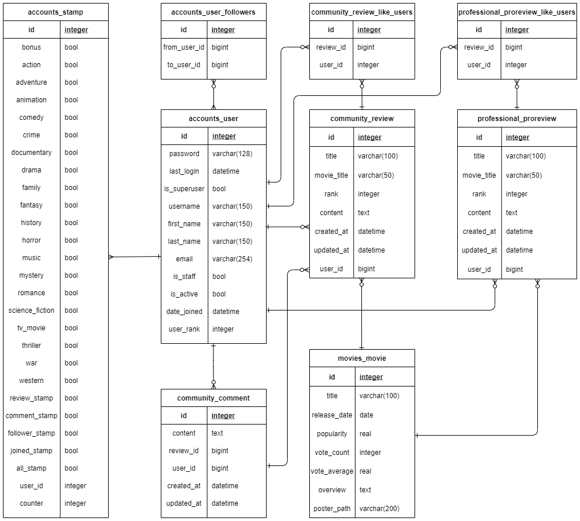

# Final-PJT

## 기본 정보

- 팀원 정보 및 업무 분담 내역

  - 조은지 : driver
  - 이경민 : navigator
  - 모든 과정을 실시간으로 동시 진행함

- 사용 Framework : Django + Vanilla JS

- 추천 알고리즘

  - 장르 기반 추천 알고리즘 제공
  - 영화 선택시 하단에 비슷한 장르의 영화 추천(TMDB API discover 사용)

- Core Value : 등급 & 스탬프

  - 커뮤니티 활성화를 위해 리뷰 작성을 독려하고 성취감을 줄 수 있는 등급제도와 스탬프 제도를 구상

  - 등급 : 1->2->3 등급제를 운영해서 접근할 수 있는 게시판과 범위가 다름
    - 1등급 : 가입 회원 - 기본 영화 정보, 기본 커뮤니티 이용 가능
    - 2등급 : 스탬프 이용 가능 회원
    - 3등급 : Pro Community(평론가 컬럼) 열람 가능
    - Pro Community는 4등급(전문 평론가)만 작성 가능
  - 스탬프
    - 2등급에서 3등급으로 넘어가기 위한 등업 조건
    - 총 25개의 스탬프가 있으며 15개 이상 모아야 등업
    - 2등급 될때 보너스 1개 + 리뷰 작성한 장르 별 19개 + 리뷰 작성 개수, 댓글 작성 개수, 팔로워 명 수, 가입 후 경과 날짜, 24개 다 모을 시 하나

- 데이터베이스 모델링(ERD)

- 목표 서비스 구현 및 실제 구현 정도
  - 목표했던 기능과 컨셉 대부분 구현

## 일자별 기록

### 일정표

|       | 핵심 과제                 | 이슈                                   |
| ----- | ------------------------- | -------------------------------------- |
| 1일차 | 기본 CRUD 기능            | Vue + DRF                              |
| 2일차 | 컨셉 정리 & 모델링        | user_rank, Stamp 구체화                |
| 3일차 | 응답 DB 저장, 등급 구현   | Vue + DRF -> Vanilla JS &Django        |
| 4일차 | 1차 점검 및 스타일링      | admin 페이지, 모델링 수정              |
| 5일차 | Pro 게시판, 스탬프 구현   | professional 앱 추가, 스탬프 구현      |
| 6일차 | 스탬프 마무리, aside 추가 | 스탬프 이미지 flaticon 사용            |
| 7일차 | 2차 스타일링              | 색상 조정, navbar 수정, 출력 요소 추가 |
| 8일차 | 프로젝트 마무리           | ERD, README 정리                       |
| 9일차 | 제출, 발표 준비           | 시연 영상, PPT 제작                    |

### 1일차(5/18)

- Vue + DRF로 구현하기로 결정, 지난 프로젝트들을 참고하며 기본 CRUD 기능을 갖춘 영화 정보 페이지 생성

> router로 params 넘겨주기/받기

- 특정 영화의 디테일 페이지로 넘어가는 버튼을 쓰기 위해서 영화 object를 인자로 보내야 하는 상황
- router에 params 값을 줬고, Vue에서` $route.params`로 받을 수 있음을 확인

> 'Object of type QuerySet is not JSON serializable' ERROR

- Vue 화면에서 Django DB에 저장된 결과를 불러와 출력하려는 상황

- 기존 django view 함수에서 querySet을 받아와 rendering 하는 부분을 JSONResponse로 대체하여 보내주기로 했는데, "Object of type QuerySet is not JSON serializable" Error
  해결방법 : 의외로 간단하게 리스트로 만들어 보내주는 것

~~~python
reviews = list(reviews.values())
context = {
    'reviews': reviews,
}
return JsonResponse(context)
~~~

### 2일차(5/19)

- 컨셉 구체화 회의 진행

> 등급 제도

0. 미가입회원 : 영화 정보 이용 가능
1. 가입회원 : 일반 커뮤니티 이용 가능
2. 일반회원 : 스탬프 획득 가능
3. 특별회원 : Pro Community 입장 가능
4. (회원이 달성할 수 없음) 전문가 : Pro Review 작성 가능

> 등급 변경 조건

0 -> 1 : Signup

1 -> 2 : 게시글 10개 이상, 댓글 10개 이상 작성

2 -> 3 : 스탬프 일정 개수 이상 획득

### 3일차(5/20)

> Django + Vanilla JS로 Framework 변경

- Vue와 Django 간의 커뮤니케이션이 잘 되지 않아 에러가 많이 발생

  login 연동이 되지 않고 별도의 로그인으로 인식하는 문제, csrf 에러 등

- Vue에서 axios로 받은 정보를 django의 DB로 저장하는데 어려움이 있음

  axios에서 받은 정보만으로 메인 페이지 렌더링이 가능하나, 명세에 따른 DB 저장과 관리자 페이지의 사용, 추후 데이터 접근성을 고려하여 DB를 쉽게 사용할 수 있는 Django로 변경

> 메인 페이지 구성

- fixtures사용이 아닌, TMDB API의 popular movies 응답 결과로 메인 페이지를 구성
- requests를 사용하여 요청을 보내고, 중복 없이 저장하는 방법 사용
- is_superuser인 경우에만 실행되고, 일반 유저인 경우에는 그냥 메인 페이지로 가도록 설정

> 영화 디테일 페이지 구성

- 해당 영화 장르들과 유사한 장르의 영화들을 아래에 추천해주도록 구성
- Movie의 genres 필드에 여러개의 genreId를 저장하기 위해 textfield에 [1, 2, 3] 형태의 문자열로 저장
- replace 함수를 이용하여 대괄호와 공백을 삭제해서 url에 넣어 axios 요청에 사용

> 1등급 -> 2등급 조건 구현

- 매 게시글 작성과 댓글 작성 시 유저 등급이 1일 경우 조건 체크하는 로직 추가

- 유저의 게시글과 댓글이 모두 10개 이상일 경우 등급을 2로 바꿔 저장

  ~~~python
  if request.user.user_rank == 1:
      if len(request.user.review_set.all()) >= 10 and len(request.user.comment_set.all()) >= 10:
          request.user.user_rank = 2
          request.user.save()
  ~~~

### 4일차(5/21)

- 명세 조건들을 체크하고, admin 페이지를 통해 영화, 사용자, 리뷰 등 생성 수정 삭제 가능하도록 함

> 메인 페이지 로직 수정

- TMDB API에서 매번 요청을 보내다 보니 평점이 달라지면 같은 영화를 다른 영화로 인식하여 다시 DB에 추가하려고 함 -> 동일 영화번호가 겹쳐 에러 발생
- Flag 역할의 전역 변수 isFirst를 만들어 첫 1회에만 작동하는 함수로 수정

> Review model 수정

- movie_title 값을 추가하여 review의 index와 detail 페이지에 표시

  기존에는 movie_id 값으로 movie와 연결되어 movie title에 접근하지 못함

- rank 값이 무한히 커지거나 음수로도 입력이 되는 문제가 있어 0~5까지만 부여할 수 있도록 강제

  django validator 사용

  ~~~python
  from django.core.validators import MinValueValidator, MaxValueValidator
  
  class Review(models.Model):
      rank = models.IntegerField(validators=[MinValueValidator(0), MaxValueValidator(5)])
  ~~~

> 댓글 수정 도전

- 비동기로 댓글 수정 기능 구현 시도
- input 칸에 기존 댓글 instance의 content를 띄우게 하고, 새로 수정 후 버튼을 누를 시 수정 후 데이터를 추출하는 데까지 성공했으나, request.POST body로 보내 view함수로 받는 부분에서 막힘
- 시간관계상 중지

> 스탬프 아이디어 구체화

- 스탬프 총 25개 (장르 19개 + 기본 1개 + 특수 5개)
- 13개 이상 달성 시 3단계 등업
- font awesome 아이콘을 사용하여 inline style의 color 값을 바꿈으로써 스탬프 찍기 구현

> 1차 스타일링

- 영화 메인 화면, 디테일 화면, 장르별 영화 추천 화면 Card Grid로 변경
- 커뮤니티 Index 표 생성

### 5일차(5/22)

> 메인 페이지 로직 수정

- 서버를 종료했다가 다시 실행하면 isFirst 전역변수가 초기값인 True로 재설정됨
- 전역 변수 선언을 settings.py로 바꾸어 달라지는지 지켜볼 예정

> Professional App 추가

- 4등급 유저 추가(Pro)
- 4등급 유저만 Pro 게시판 글 작성 가능
- 3, 4등급 유저만 Pro 게시판 열람 가능
- 1, 2등급이 게시판 열람 시도시 차단 및 Modal로 안내

> Stamp 구현 시작

- accounts 앱에 Stamp 모델 생성
- booleanField 25개 default=False로 생성
- counter 필드 값으로 스탬프 총 개수 카운트
- signup 함수에서 계정 생성 시 그 유저의 stamp도 함께 생성되도록 설정

~~~python
if request.method == 'POST':
        form = CustomUserCreationForm(request.POST)
        if form.is_valid():
            user = form.save()
            auth_login(request, user)
            # 스탬프 생성
            Stamp.objects.create(user=request.user)
            return redirect('community:index')
~~~

- 등급이 1->2가 될 때 해당 유저의 stamp의 bonus 필드 값이 true가 되도록 설정
- 영화 리뷰 작성 시 해당 장르의 스탬프 추가

> Profile 페이지에 aside 추가

- aside에 inline style 값으로 float:right;를 줘서 화면 우측에 출력
- 표 안에 각 스탬프를 넣은 후 aside에서 표시 예정

### 6일차(5/24)

> 메인 페이지 로직 수정(최종)

- 문제 1: release-date 값이 없는 개봉 예정 영화가 popular에 포함된 경우 DB에 저장하는데 에러가 있었음

  해결 : 받을 때 .get()으로 있을 경우에만 받고, 없을 경우 default 값으로 '2999-01-01'을 넣어줌

- 문제 2 : Flag 값을 settings.py에 넣어도 TMDB가 매일 새로운 정보를 주니까 갱신되면서 중복이 생김

  해결 : Flag 값이 True인 경우 기존 DB의 Movie 레코드를 모두 삭제하고, 새로운 영화 정보들을 받아오도록 함

> 스탬프 추가 조건 5개 구현

- 로그인 때마다 가입 경과 날짜 확인 : 

  가입 일자가 datetime으로 저장되고 있어서 지금 날짜와 비교하려 했으나, datetime.now()가 naive한 값이라 둘을 비교할 수 없다는 error 발생

  해결 : timezone에 기본값으로 utc timezone 추가

  ~~~python
  from pytz import timezone, utc
  
  time1 = request.user.date_joined # not naive
  time2 = datetime.datetime.now(tz=datetime.timezone.utc)
  if (time2-time1).days > 7:
      stamp = get_object_or_404(Stamp, user=request.user)
      stamp.joined_stamp = True
      stamp.counter += 1
  ~~~

- 글 작성, 댓글 작성 시 30개 이상인지 확인

- 프로필 페이지 들어갈 때마다 팔로워 명 수 확인

- 스탬프 획득 시마다 15개 모았는지(-> 3등급 변경), 24개 모았는지(-> 마지막 스탬프 획득) 조건 확인

- 버그 픽스

  장르 스탬프에서 그냥 counter += 1을 하니 중복 시에도 counter가 계속 올라가서 등업 조건이 안되는데도 등업이 되는 현상 발견하여 수정

  ~~~python
  genre_ids = list(map(int, movie.genres[1:-1].split(', ')))
  for genre in genre_ids:
      if genre == 28:
          if not stamp.action:
              stamp.action = True
              stamp.counter += 1
              continue
  ~~~

> 스탬프 이미지 변경

- 교수님의 조언으로 퀄리티 상승을 위해 font awsome 아이콘 대신 flaticon image로 변경
- False 값일 경우 흑백 이미지, True 값일 경우 컬러 이미지 렌더링
- 선 굵기 다른 이미지들 교체

### 7일차(5/25)

> 모델 수정

- Movie와 Review / ProReview가 직접 연결되지 않은 상황이 잘못된 모델링이라고 판단하여 수정
-  movie_id를 통해 연결되던 로직을 모델 연결 후 참조/역참조로 변경

> 영화 추천 목록의 영화 클릭시 이동 구현

- 기존 페이지에서는 추천 영화가 DB에 있지 않고, axios를 통해서 받아온 목록 뿐이어서 이동이 불가했음
- 이를 views.py에서 requests를 사용한 요청으로 변경
- 상위 18개 영화를 가져와서 기존 DB에 없는 경우에만 새로 DB에 저장
- detail 페이지에서 추천 카드를 누를 경우 해당 영화의 detail 페이지로 redirect되도록 구현

~~~python
# 장르 추천기능
for recommend in recommend_list:
    # 기존 DB에 있는 영화의 경우
    movie_id = recommend.get('id')
    if Movie.objects.filter(movie_id=movie_id).exists():
        continue
        # 새로운 영화일 경우 DB에 새로 저장
    else:
        title = recommend.get('original_title')
        overview = recommend.get('overview')
        if recommend.get('release_date'):
            release_date = recommend.get('release_date')
        else:
            release_date = '2999-01-01'
            ...
            Movie.objects.create(title=title, ...)
~~~

> 메인 페이지에서 스탬프 보이도록 추가

- 팝업창 만들기를 시도했으나 대부분의 예시들이 jQuery를 사용하고 있어 다른 방법을 찾기로 함
- Modal을 이용하여 navbar의 회원 등급을 클릭시 모달 팝업
- 모달 안에 bootstrap Figures를 이용하여 이미지, 설명 삽입

> 2차 스타일링

- navbar 수정

  - 태그 수정, 정렬 추가, 로고 이미지 배경 투명한 것으로 교체

- profile 페이지 수정

  - 페이지 레이아웃 변경, 게시글 링크 연결

- community 페이지 수정

  - 게시글 내용 입력시 엔터를 인식하지 못함

    linebreaks 필터를 사용하여 엔터 인식하도록 해결

  ~~~django
  
{{ review.content|linebreaks }}

  ~~~

- Header, Footer 생성

- 색감 변경 (Green, White -> Grey, Light)

- List group 사용

  Movie detail의 최신 리뷰 목록과 profile의 작성 글 목록 등에 사용

### 7일차(5/26)

> 스타일링 마무리

- Header 변경
- Font 추가
- Pro community 변경사항 반영

> ERD, README 작성

- ERD 작성 : 경민 
- README 작성 : 은지

> Movie 로직 수정

- 메인페이지의 영화들을 가져오는 로직에서 중복 방지를 위해 기존 저장되어 있던 영화 레코드들을 삭제하고 다시 생성 -> 연결된 모든 리뷰들도 삭제되는 문제
- 해결 : 장르 추천 로직처럼 DB에 이미 있는 영화면 넘어가고 없는 영화면 추가하는 로직으로 변경

### 8일차(5/27)

> 시연준비

- 시연용 더미 데이터 생성
- 시연 영상 촬영, 편집

> 발표준비

- 발표 및 Q&A 준비
- PPT 제작

> 프로젝트 제출

## 총평

- 은지 : 

  우선 계획을 체계적이고 현실적으로 세우는 것의 중요성과, 그럼에도 불구하고 계획대로 진행되지 않을 수 있음을 항상 고려해야 함을 가장 크게 느꼈던 것 같다. 이번 프로젝트의 경우 큰 틀에서 보자면 다행히도 처음 일자별 계획에서 거의 틀어지지 않았는데, 그래도 세부적인 부분은 예상치 못한 상황들에 따라 많은 변동이 있었다. 이런 점들을 고려해서 일정을 너무 촉박하게 짜지 않으려 했는데 결과적으로 완성의 측면에서는 만족스러웠지만, 동시에 조금 더 욕심낼 수 있었던 부분들이 있다고 느껴져 아쉬움도 있다. 초반에 잡은 컨셉과 기능들을 무사히 구현해내고 싶은 마음이 가장 컸기에 어느정도 안전한 선택을 한 부분들이 있다. 프레임워크에서도 Vue를 선택하지 않았고, 있으면 좋겠지만 당장 시간이 너무 걸리거나 기존 로직과 충돌할 것 같은 기능들을 포기하기도 했다. 돌이켜보니 아쉬운 점이 있지만 그래도 결과물에 큰 애정을 느끼며, 일주일동안 많이 성장했다고 생각한다!

- 경민 : 

  처음으로 진행해 본 대규모 프로젝트라, 주어진 기간 동안 우리가 얼마나 많은 개발을 진행할 수 있을지 감이 잡히지 않았고, 어떤 기능을 필수로 분류하고 어떤 기능을 차순위로 미룰지 많은 고민을 하게 되었다. 우리가 핵심 기능으로 선정하였던 스탬프 기능과, 이에 연동되는 회원등급 기능은 성공적으로 구현하였다. 하지만 시간과 지식, 개발경험 등의 여러 한계에 부딪혀 세부적인 측면에서 구현하지 못한 여러 기능들 (ex. 댓글 비동기 수정 기능, pagination 등)이 아쉬움을 남겼다. 또한 스타일링과 슬로건 선정 작업에 많은 시간을 할애하며, 개발을 함에 있어서 개발자의 개발 역량도 물론 중요하지만, 창의력과 상상력 등 비 기술적인 부분들도 정말 중요하다는 사실을 깨닫게 되었다.
